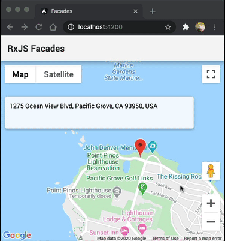

# RxJS Facades



To launch, go to line 19 of `index.html` and put your Google Maps Key where it says `{PLACE_YOUR_KEY_HERE}`:

```html
<script
  type="text/javascript"
  src="https://maps.googleapis.com/maps/api/js?key={PLACE_YOUR_KEY_HERE}&libraries=places"
></script>
```

This project was generated with [Angular CLI](https://github.com/angular/angular-cli) version 10.0.3.

## Development server

Run `ng serve` for a dev server. Navigate to `http://localhost:4200/`. The app will automatically reload if you change any of the source files.
